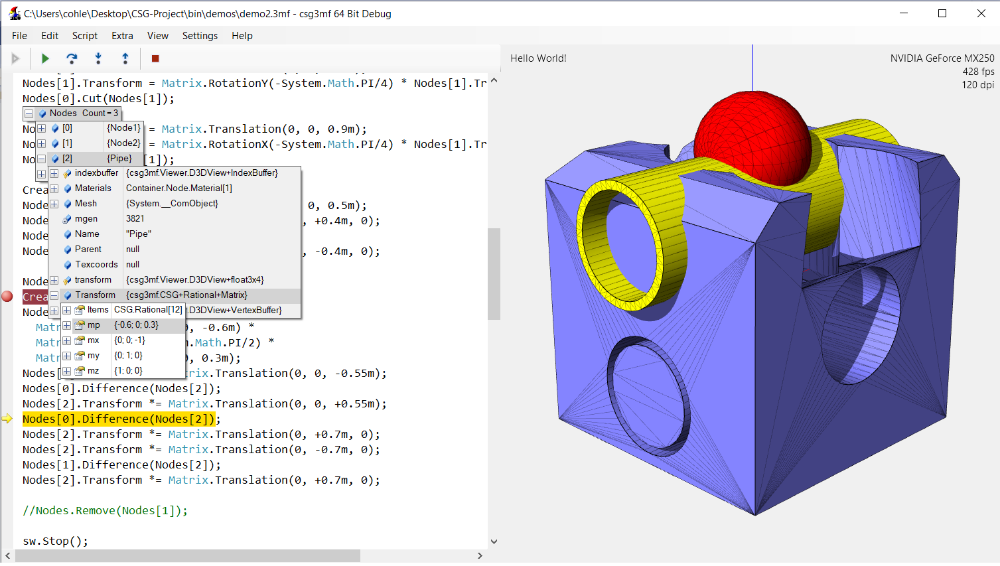
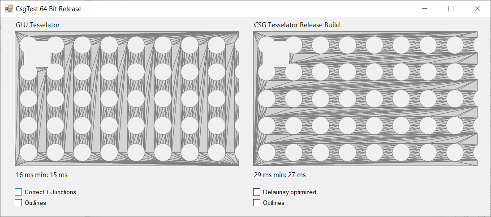
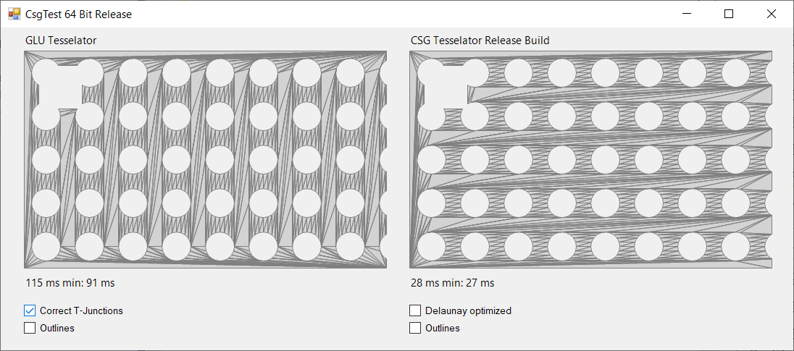
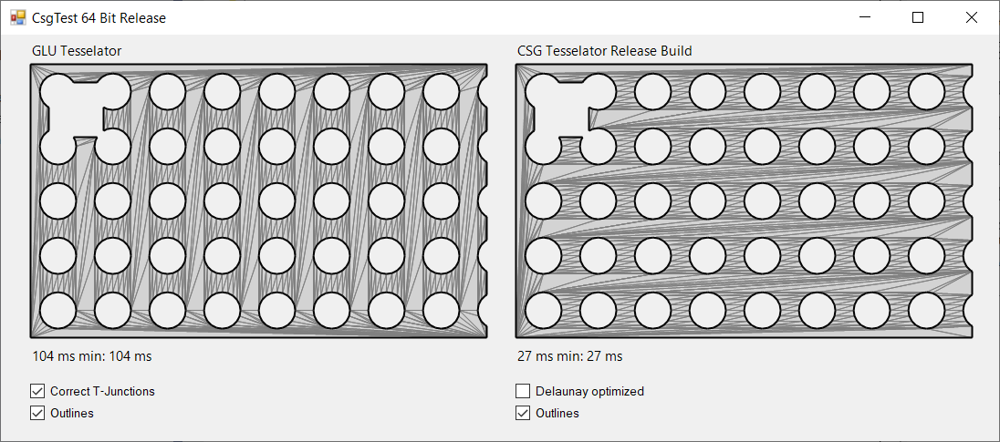
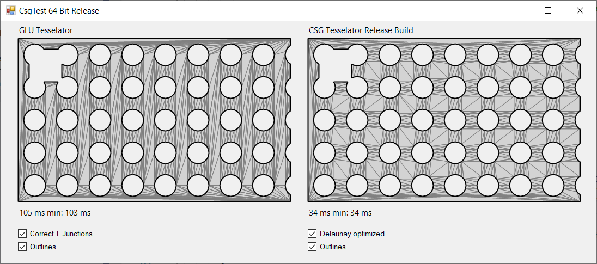

# CSG for 3MF Project

(Description for the new solution based on the new algorithm described below coming soon. The unlimited robustness and precision of the new approach allows constructions of unlimited complexity.)

The plan is to develop a COM component for CSG functions as described in:
https://en.wikipedia.org/wiki/Constructive_solid_geometry.
The central algorithm for this is Tessellation to calculate triangle mesh and outlines from polygons.
This algorithm of course should be fast and robust as possible.

Since decades the most common algorithm in use is known from OpenGL GLU Tesselator as described here:
https://www.glprogramming.com/red/chapter11.html

This algorithm is really very fast. For CSG however he has some great disadvantages:
Main disadvantage is that the algorithm generates T-junctions, other geometrical artefacts, does not handle inline points etc.
This requires in praxis several tesselation steps and a final correction of the result - more time consuming than the tesselation itself.

Therefore here a new Tessellation algorithm, more efficient especially for CSG that can generate perfect polygon meshes and outlines in one step without artefacts and inline-points.

Left side Windows System OpenGL GLU Tesselator.
Right side the new Tesselator shown as CSG Tesselator. 
  

Image 1 shows: for a pure tessellation without mesh corrections and outline GLU Tessellator can be two times faster.  

Image 2 shows: only the correction of T-junctions for GLU makes the new algorithm already 3 times faster. 

Image 3: outline calculation for the new one cost no extra time.

Image 4: Optional: the new algorithm can directly produce delaunay optimized meshes in one step. This is effective for CSG because it avoids needle polygones and the sucessive more cuts and polygones to calculate. For GLU it would require another time intensive calculation step.

Note: For compilation start Visual Studion as Administrator that the COM object can be registered.

I would be happy for suggestions, improvements.